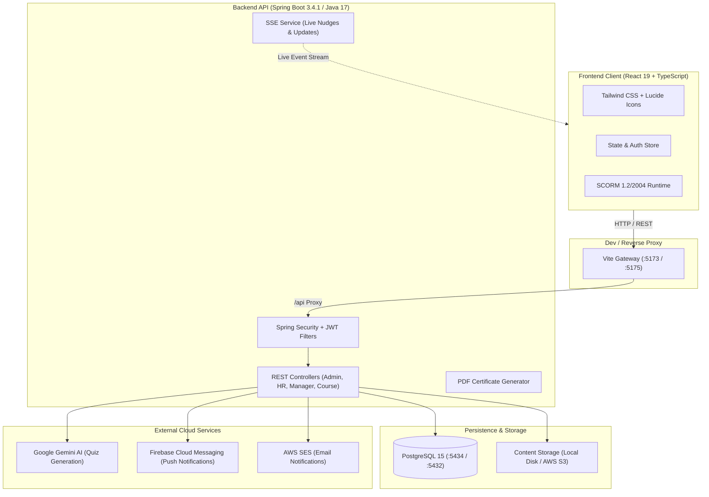

# Corporate Learning Management System (CLMS)

[](https://spring.io/projects/spring-boot)
[](https://react.dev/)
[](https://www.typescriptlang.org/)
[](https://www.postgresql.org/)
[](https://www.docker.com/)
[](https://deepmind.google/technologies/gemini/)

> An intuitive, full-stack corporate learning platform built for real organizations—designed to take the friction out of employee onboarding, compliance training, skill development, and team coaching.

---

## 💡 Why We Built This

Most corporate learning platforms feel like they were built decades ago: cluttered interfaces, clunky course uploads, endless spreadsheets for tracking compliance, and generic quizzes that everyone just clicks through without learning.

Meanwhile:
- **HR & L&D teams** struggle to publish rich multimedia content without relying on IT.
- **Managers** lack quick visibility into who on their team is falling behind or blocked.
- **Employees** find the training disconnected, dry, and slow.

We built **CLMS** for the **Excellathon** challenge to bridge these gaps. It provides a clean, responsive, and role-tailored platform where courses are easy to create, team progress is visible in real-time, learning feels modern and engaging, and verifiable certificates are earned automatically.

---

## 🎯 Designed for Real People: 4 Tailored Workflows

CLMS gives every user a dashboard purpose-built for their day-to-day responsibilities:

### 1. 🎨 HR & Learning Designers (`/hr`)
- **Course Authoring Studio**: Create comprehensive training paths organized into logical modules and sessions with clear learning outcomes and completion deadlines.
- **Rich Media Support**: Upload and stream video lessons, PDF reading materials, slide decks (PPTX), and standard interactive SCORM 1.2 / 2004 packages.
- **High-Capacity File Pipeline**: Handles uploads up to 500MB with transparent support for both local filesystem storage and AWS S3.
- **Automated Certification Rules**: Configure course completion criteria so passing learners automatically receive official credentials.

### 2. 📈 Team Managers (`/manager`)
- **Team Pulse Dashboard**: Monitor team enrollment, progress percentages, completion rates, and overdue items at a glance.
- **1-Click Gentle Nudges**: Send friendly reminder notifications to team members who are falling behind schedule—no awkward manual emails required.
- **Approvals & Change Requests**: Review and approve course enrollment requests, due date extension requests, and profile updates.
- **Live Updates via SSE**: Live updates powered by Server-Sent Events (SSE) keep dashboards synced without manual page refreshes.

### 3. 🎓 Employees & Learners (`/employee`)
- **Distraction-Free Course Player**: Seamlessly switch between videos, documents, slide decks, and interactive SCORM modules.
- **AI-Assisted Assessments**: Test understanding with dynamic quizzes powered by Google Gemini AI.
- **Instant Verifiable Certificates**: Complete all required modules and assessments to instantly download a personalized PDF certificate complete with a unique verification hash.
- **Personal Progress Tracker**: Keep tabs on enrolled courses, upcoming deadlines, and completed milestones.

### 4. ⚙️ System Administrators (`/admin`)
- **User & Role Management**: Provision new accounts, assign organizational roles (Admin, HR, Manager, Employee), and manage user status.
- **Team & Department Hierarchy**: Create teams, designate team leads/managers, and map employees to departments.
- **Audit Logging**: Trace administrative actions, account changes, and system events for organizational transparency and compliance.

---

## 🏛️ System Architecture



---

## 🛠️ The Tech Stack (And Why We Picked It)

| Layer | Technology | Why We Chose It |
| :--- | :--- | :--- |
| **Frontend** | **React 19 + TypeScript + Vite** | Blazing fast build times, strong type safety across API contracts, and optimal rendering performance. |
| **Styling & UI** | **Tailwind CSS + Lucide Icons** | Clean, accessible design system with responsive layouts across desktop, tablet, and mobile. |
| **Backend** | **Spring Boot 3.4.1 (Java 17)** | Enterprise-grade reliability, clean modular package architecture, and rock-solid RESTful APIs. |
| **Security** | **Spring Security 6 + Stateless JWT** | Secure, role-based route guards and fine-grained endpoint authorization without server session bloat. |
| **Database** | **PostgreSQL 15** | Robust relational model for complex hierarchies (courses, modules, sessions, enrollments, audit logs). |
| **AI Assessment**| **Google Gemini API** | Contextual quiz generation that creates challenging, relevant questions directly from course descriptions and materials. |
| **Notifications**| **SSE + FCM + AWS SES** | Multi-channel communication: in-app real-time alerts, push notifications, and formal email notifications. |
| **Orchestration**| **Docker Compose** | One command brings up the entire stack with health checks, seeded databases, and pre-configured networking. |

---

## ⚡ Quick Start: Up & Running in Under 2 Minutes

Pick whichever launch method fits your workflow best:

### Option A: 1-Click Launch (Windows Recommended)
If you're on Windows, we've automated the entire startup routine. Double-click:
```bat
start-all.bat
```
Or run the equivalent PowerShell script:
```powershell
.\start-dev.ps1
```
> **What this does automatically:** Checks if PostgreSQL is reachable, starts it via Docker if needed, launches the Spring Boot backend and Vite frontend in parallel, and pops open your default browser directly to the login page.

---

### Option B: Full-Stack Docker Compose
Prefer running everything inside containers? Launch the full stack with:
```bash
docker compose up --build
```
Once healthy, access your services at:
- **Web App**: [http://localhost:5173](http://localhost:5173) (or `5175` if `5173` is busy)
- **Backend API**: [http://localhost:8080/api](http://localhost:8080/api)
- **PostgreSQL**: `localhost:5434`

*Need just the database in Docker while running code locally?*
```bash
docker compose up -d postgres
```

---

### Option C: Manual Local Development
If you prefer running each service directly in your terminal:

1. **Start PostgreSQL**: Make sure PostgreSQL is running on port `5434` with database `clms_db` (user: `postgres`, password: `12345`). Or run `docker compose up -d postgres`.
2. **Start Backend**:
   ```bash
   cd Backend
   # Windows
   .\mvnw.cmd spring-boot:run
   # macOS / Linux
   ./mvnw spring-boot:run
   ```
3. **Start Frontend**:
   ```bash
   cd FrontEnd
   npm install
   npm run dev
   ```

---

## 🔑 Ready-to-Use Demo Accounts

The database comes pre-seeded with accounts for all roles so you can jump in and test immediately.

All test accounts share the same default password: **`Welcome@123`**

| Role | Name | Email | Password | Landing Page |
| :--- | :--- | :--- | :--- | :--- |
| ⚙️ **ADMIN** | Admin User | `admin@clms.com` | `Welcome@123` | `/admin` |
| 🎨 **HR** | HR Specialist | `hr@clms.com` | `Welcome@123` | `/hr` |
| 📈 **MANAGER** | Sarah Mitchell | `manager@clms.com` | `Welcome@123` | `/manager` |
| 🎓 **EMPLOYEE** | John Doe | `employee@clms.com` | `Welcome@123` | `/employee` |
| 🎓 **EMPLOYEE** | Alice Johnson | `alice@clms.com` | `Welcome@123` | `/employee` |
| 🎓 **EMPLOYEE** | Bob Smith | `bob@clms.com` | `Welcome@123` | `/employee` |
| 🎓 **EMPLOYEE** | Charlie Brown | `charlie@clms.com` | `Welcome@123` | `/employee` |

> 💡 **Quick Login Tip**: You don't even need to type! The login screen features convenient **1-Click Quick Fill** buttons (`[Admin]`, `[HR]`, `[Manager]`, `[Employee]`) that instantly populate test credentials.

---

## 📂 Repository Tour

Here is how the project is organized:

```
.
├── Backend/                     # Spring Boot 3.4.1 (Java 17) REST API
│   ├── src/main/java/com/example/clms/
│   │   ├── admin/               # User provisioning & system administration
│   │   ├── auth/                # JWT authentication, token filters & security
│   │   ├── config/              # CORS rules, global exception handling, configs
│   │   ├── course/              # Courses, modules, sessions, outcomes & certificates
│   │   ├── dashboard/           # Metrics and aggregated dashboard statistics
│   │   ├── hr/                  # HR authoring endpoints & multipart file uploads
│   │   ├── manager/             # Team management, live nudges, change requests & SSE
│   │   ├── notification/        # Multi-channel alerts (SSE, FCM, AWS SES email)
│   │   ├── progress/            # Granular learner progress tracking
│   │   ├── scorm/               # SCORM 1.2 / 2004 package parser & runtime tracking
│   │   ├── team/                # Team creation and department structure
│   │   └── user/                # User entities, repositories & password hashing
│   ├── Dockerfile               # Multi-stage production container build
│   └── pom.xml                  # Maven dependencies & plugins
│
├── FrontEnd/                    # React 19 + TypeScript + Vite Client
│   ├── src/
│   │   ├── admin/               # Admin dashboard, user management & logs
│   │   ├── hr/                  # Course builder, session editor, multimedia uploader
│   │   ├── manager/             # Team progress overview, nudging & request approvals
│   │   ├── employee/            # Course catalog, multimedia player & certificate viewer
│   │   ├── components/          # Reusable design components (cards, modals, badges)
│   │   ├── pages/               # Login, registration, landing & error views
│   │   ├── routes/              # Protected role-based routing
│   │   └── shared/              # Common utilities, API clients & helpers
│   ├── Dockerfile               # Production container build with Nginx
│   └── vite.config.ts           # Vite dev server & API proxy configuration
│
├── Database/                    # Initial database schemas and seed migrations
├── docker-compose.yml           # Full-stack container orchestration
├── start-all.bat                # 1-click Windows startup batch script
├── start-dev.ps1                # PowerShell startup script with health check detection
├── RUN_GUIDE.md                 # Detailed operational & troubleshooting handbook
└── README.md                    # You are here!
```

---

## 🔒 Configuration & Environment

- **Secret Management**: Environment variables are managed through local `.env` files that remain strictly ignored by Git. See `.env.example` in both `Backend/` and `FrontEnd/` for all available options.
- **Dynamic CORS**: Pre-configured to seamlessly accept requests from Vite development ports (`5173`, `5174`, `5175`) and Docker networks.
- **Storage Flexibility**: Switch between local filesystem storage (ideal for rapid offline development) and cloud AWS S3 bucket storage with a simple configuration toggle.
- **Large Asset Handling**: Spring Boot multipart resolver is configured with a 500MB threshold to comfortably handle high-definition training videos and SCORM archives.

---

## 📖 Need More Details?

For in-depth setup troubleshooting, database reset procedures, and step-by-step feature walkthroughs, refer to our comprehensive [RUN_GUIDE.md](RUN_GUIDE.md).

---

<div align="center">
  <sub>Built with ❤️ for the <strong>Excellathon</strong> Challenge.</sub>
</div>
