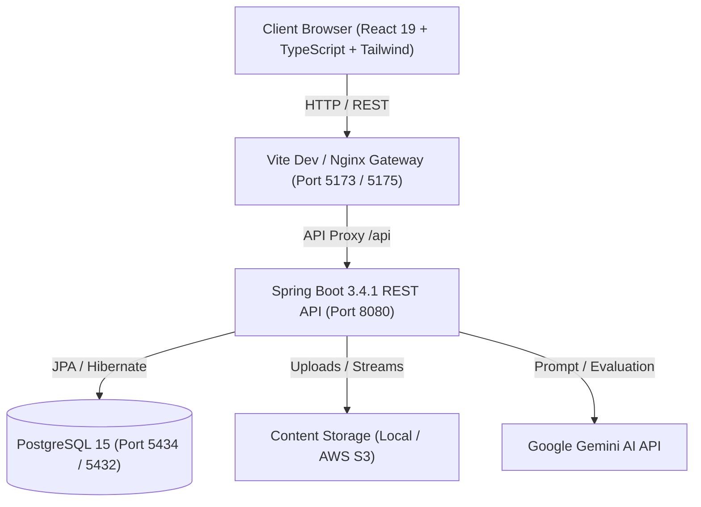

# Corporate Learning Management System (CLMS) - Excellathon

[](https://spring.io/projects/spring-boot)
[](https://react.dev/)
[](https://www.typescriptlang.org/)
[](https://www.postgresql.org/)
[](https://www.docker.com/)

An enterprise-grade, full-stack **Corporate Learning Management System (CLMS)** designed to streamline employee onboarding, compliance tracking, role-based upskilling, manager approvals, HR course authoring, automated certificate generation, and AI-powered assessments.

---

## 🌟 Key Features

- 👥 **Role-Based Access Control (RBAC)**: Distinct dashboards and permissions for **Admin**, **HR**, **Manager**, and **Employee**.
- 📚 **Comprehensive Course Authoring**: Create modules, sessions, and outcomes with support for video, PDF, PPT, and SCORM packages.
- ☁️ **Flexible Content Delivery**: Local and AWS S3 storage support with high-throughput multipart upload up to 500MB.
- 🎓 **Automated Certificate Generation**: Dynamic PDF certificate issuance with unique verification hashes.
- 🤖 **AI-Assisted Learning**: Integrated Gemini AI for dynamic quiz and assessment generation.
- 📊 **Manager & HR Analytics**: Real-time progress monitoring, team completion rates, and approval workflows.
- 🐳 **Containerized & Orchestrated**: Full Docker Compose setup with health checks and zero-configuration launch scripts.

---

## 🏛️ System Architecture



---

## 🚀 Quick Start Guide

### Option 1: 1-Click Launch (Windows)
Double-click:
```bat
start-all.bat
```
Or execute in PowerShell:
```powershell
.\start-dev.ps1
```
*This automatically verifies PostgreSQL, launches the backend and frontend in parallel, and opens your browser.*

### Option 2: Docker Compose (Full Stack)
```bash
docker compose up --build
```
- **Frontend**: [http://localhost:5173](http://localhost:5173)
- **Backend API**: [http://localhost:8080/api](http://localhost:8080/api)
- **PostgreSQL**: `localhost:5434`

To start **only PostgreSQL** in Docker:
```bash
docker compose up -d postgres
```

### Option 3: Manual Execution

#### 1. Start Database
Ensure PostgreSQL is running on port `5434` (database `clms_db`, user `postgres`, password `12345`).

#### 2. Start Backend
```bash
cd Backend
# Windows
.\mvnw.cmd spring-boot:run
# Linux / macOS
./mvnw spring-boot:run
```

#### 3. Start Frontend
```bash
cd FrontEnd
npm install
npm run dev
```

---

## 🔑 Pre-Configured Test Credentials

All pre-seeded test accounts use the password: **`Welcome@123`**

| Role | Name | Email | Password | Default Route |
| :--- | :--- | :--- | :--- | :--- |
| **ADMIN** | Admin User | `admin@clms.com` | `Welcome@123` | `/admin` |
| **HR** | HR Specialist | `hr@clms.com` | `Welcome@123` | `/hr` |
| **MANAGER** | Sarah Mitchell | `manager@clms.com` | `Welcome@123` | `/manager` |
| **EMPLOYEE** | John Doe | `employee@clms.com` | `Welcome@123` | `/employee` |
| **EMPLOYEE** | Alice Johnson | `alice@clms.com` | `Welcome@123` | `/employee` |
| **EMPLOYEE** | Bob Smith | `bob@clms.com` | `Welcome@123` | `/employee` |
| **EMPLOYEE** | Charlie Brown | `charlie@clms.com` | `Welcome@123` | `/employee` |

> ⚡ **Tip**: The login page includes **1-Click Quick Fill** buttons (`[Admin]`, `[HR]`, `[Manager]`, `[Employee]`) to instantly fill credentials.

---

## 📁 Repository Structure

```
.
├── Backend/                    # Spring Boot 3.4.1 (Java 17) REST API
│   ├── src/main/java/com/example/clms/
│   │   ├── admin/              # User management & administration
│   │   ├── auth/               # JWT authentication & role filters
│   │   ├── config/             # Security, CORS, and Exception handling
│   │   ├── course/             # Course, module & session management
│   │   ├── hr/                 # HR course creation & upload endpoints
│   │   ├── manager/            # Team tracking & approvals
│   │   ├── progress/           # Employee learning progression
│   │   └── user/               # User entities & repositories
│   ├── Dockerfile
│   └── pom.xml
├── FrontEnd/                   # React 19 + Vite + TypeScript
│   ├── src/
│   │   ├── admin/              # Admin control panel
│   │   ├── hr/                 # Course authoring, upload, outcomes
│   │   ├── manager/            # Manager team dashboard
│   │   ├── employee/           # Course catalog, player & certificates
│   │   ├── components/         # Shared UI components
│   │   └── pages/              # Auth & root pages
│   ├── Dockerfile
│   └── vite.config.ts
├── Database/                   # Initial DB schemas & migrations
├── docker-compose.yml          # Full-stack Docker orchestration
├── start-all.bat               # 1-Click Windows execution script
├── start-dev.ps1               # Cross-platform PowerShell execution
├── RUN_GUIDE.md                # Comprehensive operation guide
└── README.md
```

---

## 🛡️ Security & Configuration

- **Environment Secrets**: Secrets are kept outside version control using `.env` files (see `.env.example` templates in `Backend/` and `FrontEnd/`).
- **CORS Support**: Dynamic origin matching for development across ports `5173`, `5174`, `5175`, and Docker networks.
- **Multipart Uploads**: Configured with a 500MB ceiling for multimedia course content.

For additional documentation, refer to [RUN_GUIDE.md](RUN_GUIDE.md).
