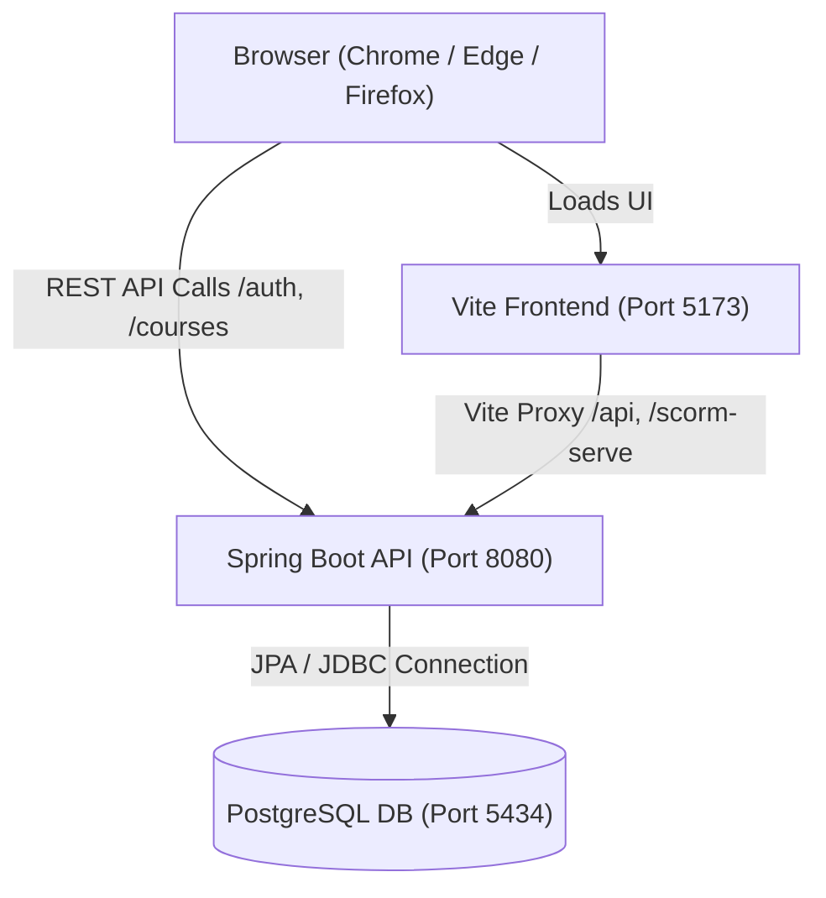

# CLMS Execution & Operation Guide

Welcome to the **Corporate Learning Management System (CLMS)** run guide. This document provides clear, step-by-step instructions to run, configure, and operate the platform.

---

## ⚡ Quick Start Options

### Option 1: 1-Click Launch (Recommended for Windows)
Simply double-click:
```bat
start-all.bat
```
Or in PowerShell:
```powershell
.\start-dev.ps1
```
**What this does:**
1. Validates PostgreSQL connectivity on port `5434` (or starts the Docker database container automatically if needed).
2. Launches the Spring Boot backend on `http://localhost:8080` in a new window.
3. Launches the React/Vite frontend on `http://localhost:5173` in a new window.
4. Opens your default browser directly to the login portal.

---

### Option 2: Docker Compose (Full Stack in Containers)
To run the database, backend, and frontend inside isolated containers:
```bash
docker compose up --build
```
- Frontend: `http://localhost:5173`
- Backend API: `http://localhost:8080/api`
- PostgreSQL: `localhost:5434`

To run **only** the PostgreSQL database via Docker while running backend and frontend locally:
```bash
docker compose up -d postgres
```
(Or double-click `start-db.bat`).

---

### Option 3: Manual Execution (Terminal by Terminal)

#### 1. Start PostgreSQL
Ensure PostgreSQL is listening on port `5434` with user `postgres` and password `12345`, with database `clms_db`:
```bash
# Via Docker:
docker compose up -d postgres
```

#### 2. Start Backend (Spring Boot)
```bash
cd Backend
.\mvnw.cmd spring-boot:run
# On Linux/macOS:
./mvnw spring-boot:run
```
Backend will start on `http://localhost:8080`.

#### 3. Start Frontend (React + Vite)
```bash
cd FrontEnd
npm install
npm run dev
```
Frontend will be available on `http://localhost:5173`.

---

## 🔑 Pre-seeded Demo Accounts

All pre-seeded accounts share the password: **`Welcome@123`**

| Role | Name | Email | Password | Dashboard Route |
| :--- | :--- | :--- | :--- | :--- |
| **ADMIN** | Admin User | `admin@clms.com` | `Welcome@123` | `/admin` |
| **HR** | HR Specialist | `hr@clms.com` | `Welcome@123` | `/hr` |
| **MANAGER** | Sarah Mitchell | `manager@clms.com` | `Welcome@123` | `/manager` |
| **EMPLOYEE** | John Doe | `employee@clms.com` | `Welcome@123` | `/employee` |
| **EMPLOYEE** | Alice Johnson | `alice@clms.com` | `Welcome@123` | `/employee` |
| **EMPLOYEE** | Bob Smith | `bob@clms.com` | `Welcome@123` | `/employee` |
| **EMPLOYEE** | Charlie Brown | `charlie@clms.com` | `Welcome@123` | `/employee` |

> [!TIP]
> On the login page, you can click any of the **⚡ 1-Click Demo Fill** buttons (`[Admin]`, `[HR]`, `[Manager]`, `[Employee]`) to instantly populate credentials and role selection.

---

## ⚙️ Architecture & Port Mapping



- **Frontend Port**: `5173`
- **Backend API Port**: `8080`
- **Database Port**: `5434` (mapped from Docker container 5432 or native service)

---

## 🛠️ Individual Helper Scripts

- `start-all.bat` - Starts DB check + Backend + Frontend + Opens Browser
- `start-backend.bat` - Starts only the Spring Boot backend
- `start-frontend.bat` - Starts only the Vite frontend dev server
- `start-db.bat` - Starts only the PostgreSQL database container
- `start-dev.ps1` - PowerShell runner with status checks
- `start-dev.sh` - Linux/macOS/WSL runner

---

## ❓ Troubleshooting

### 1. Database Connection Refused (`localhost:5434`)
- Check if PostgreSQL is running on port 5434:
  ```powershell
  Test-NetConnection -ComputerName localhost -Port 5434
  ```
- If you use Docker, run `docker compose up -d postgres`.
- If your local PostgreSQL is running on default port `5432` instead of `5434`, you can override it in your environment or set `DB_PORT=5432` in `Backend/.env`.

### 2. Login Issues
- All pre-seeded accounts use password `Welcome@123`.
- Email lookups are case-insensitive (`admin@clms.com`, `Admin@clms.com` work identically).
- Leading and trailing spaces are automatically trimmed.
- If you log in with correct credentials, the system automatically redirects you to your appropriate role dashboard.
